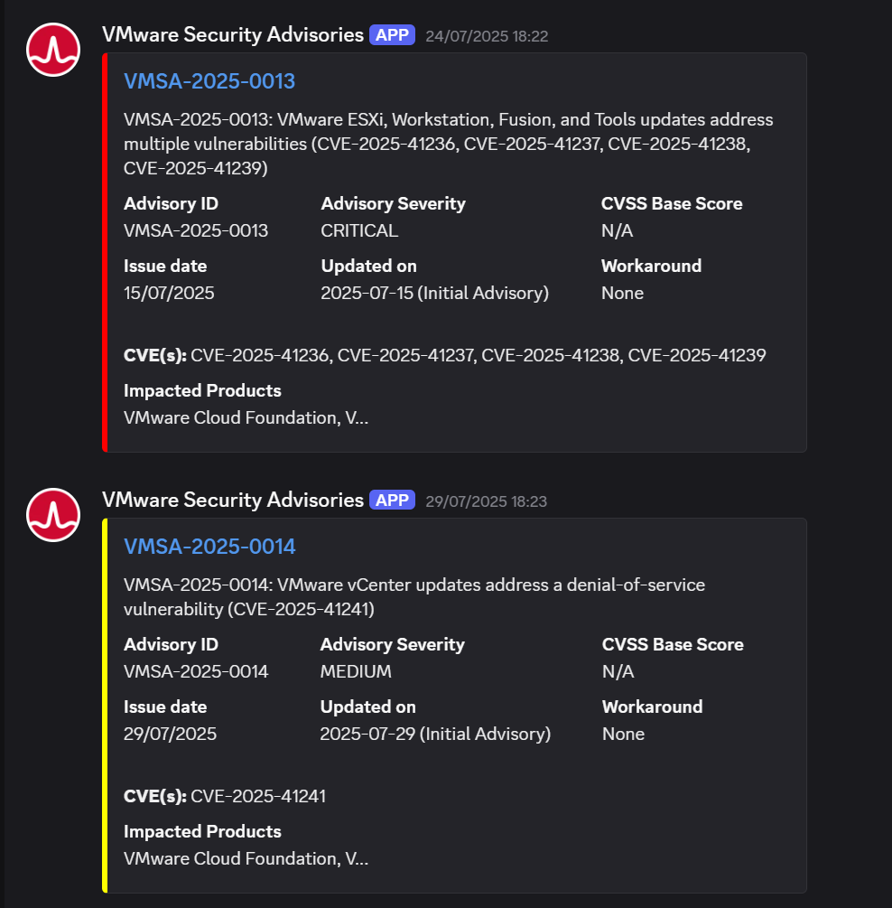

# vmware-security-monitor

> 🔒 Monitoramento automatizado de alertas de segurança da VMware (Broadcom), com envio estruturado de notificações para um canal do Discord.

---

## 📌 Objetivo

O `vmware-security-monitor` tem como principal finalidade monitorar o portal de [Security Advisories da Broadcom](https://support.broadcom.com/web/ecx/security-advisory) e **notificar automaticamente via Discord** sobre novos alertas de segurança relacionados a produtos VMware críticos para infraestrutura de TI.

Essa automação foi criada com foco em:

- Proatividade na resposta a vulnerabilidades
- Agilidade na identificação de falhas críticas
- Redução de riscos operacionais
- Evitar verificações manuais recorrentes no portal da Broadcom

---

## 🚨 O Problema

O portal oficial da Broadcom que publica os **VMware Security Advisories (VMSA)** não oferece nativamente suporte a **webhooks**, **RSS** ou **integrações automáticas** com ferramentas como Discord, Slack, Zabbix, etc. Isso dificulta o monitoramento contínuo de novos avisos de segurança.

Além disso, a consulta exige filtragem manual para:
- Filtros aplicados por:
  - Severidade (`CRITICAL`, `HIGH`, `MEDIUM`, `LOW`)
  - Produtos impactados (lista personalizada)
  - Datas (últimos X dias)
- Cache local para evitar reenvio de advisories já notificados
- Envio formatado com embeds para o Discord
- Execução automática via **GitHub Actions**
- Persistência segura utilizando **GitHub Actions Cache (v4)**

---

## 🧠 Estratégia de Solução

Foi desenvolvido um **script Python** automatizado com as seguintes funcionalidades:

- Acesso via API JSON ao portal Broadcom (método `POST`)
- Filtragem por severidade, produtos VMware utilizados na organização e data (últimos 10 dias)
- Suporte a modo de simulação (sem envio real)
- Evita alertas duplicados com cache local persistente
- Envio automático e formatado para um canal **webhook do Discord**
- Execução agendada com GitHub Actions (cron job) 
- Mensagem no Discord com:
  - Título (ID do advisory com link)
  - Descrição
  - Informações técnicas (severity, synopsis, CVE, data, workaround, CVSS Range)
  - Lista de produtos impactados
- Suporte à nova versão `actions/upload-artifact@v4`

O script está preparado para rodar periodicamente via **GitHub Actions**, com dois agendamentos diários (início e fim do expediente), sem necessidade de infraestrutura própria.

---

## 🛠️ Tecnologias Utilizadas

- [Python 3.9+](https://www.python.org/)
- `requests` (HTTP client)
- `json` (manipulação dos dados)
- `os` e `datetime` (manipulação de ambiente e datas)
- [GitHub Actions](https://github.com/features/actions) (agendamento gratuito)
- [Discord Webhooks](https://discord.com/developers/docs/resources/webhook) (para envio de notificações)

Instalação local:
```bash
pip install -r requirements.txt
```
---

## ⚙️ Como funciona

1. O GitHub Actions executa o script Python 2x por dia
2. O script consulta os últimos 10 security advisories do portal Broadcom
3. Filtra alertas com severidade e produtos específicos
4. Verifica se o alerta já foi enviado anteriormente (via cache local)
5. Envia uma mensagem formatada para um canal no Discord

---

## ✅ Pré-requisitos

- Conta no GitHub
- Canal Discord com webhook configurado
- GitHub Secret: `DISCORD_WEBHOOK_URL`
- GitHub Action configurada (cron ou execução manual)

---

## 🧪 Simulação local

Você pode testar o script localmente com:

```bash
export SIMULATE=true
python main.py
```

---

## 📁 Estrutura de arquivos
```bash
vmware-security-monitor/
├── main.py               # Código principal
├── advisory_cache.json   # Cache local de advisories enviados
├── requirements.txt       # Dependências do projeto
├── .github/workflows/
│   └── monitor.yml        # Agendamento via GitHub Actions
├── README.md             # Este arquivo
```

## ✅ Exemplo de payload enviado para Discord

- Título com o ID do Advisory (ex: VMSA-2025-0012)
- Descrição com título completo do advisory
- Campos: CVSS, Severidade, CVEs, Workaround, Data de publicação, Produtos impactados
  
<p align="center">
  
</p>

---

## 🔐 Segurança

- Utiliza cache persistente via **GitHub Actions Cache (v4)** para manter histórico seguro dos advisories processados

---

## 🛠️ Contribuições

Pull Requests são bem-vindos. Sugestões de novos filtros ou melhorias na formatação do Discord são incentivadas.

---

## 👨‍💻 Autor

Desenvolvido por Ricardo Marques — especialista em infraestrutura VMware, segurança e automações com IA.

---

## 📜 Licença

Este projeto é open-source e distribuído sob a [MIT License](LICENSE).


